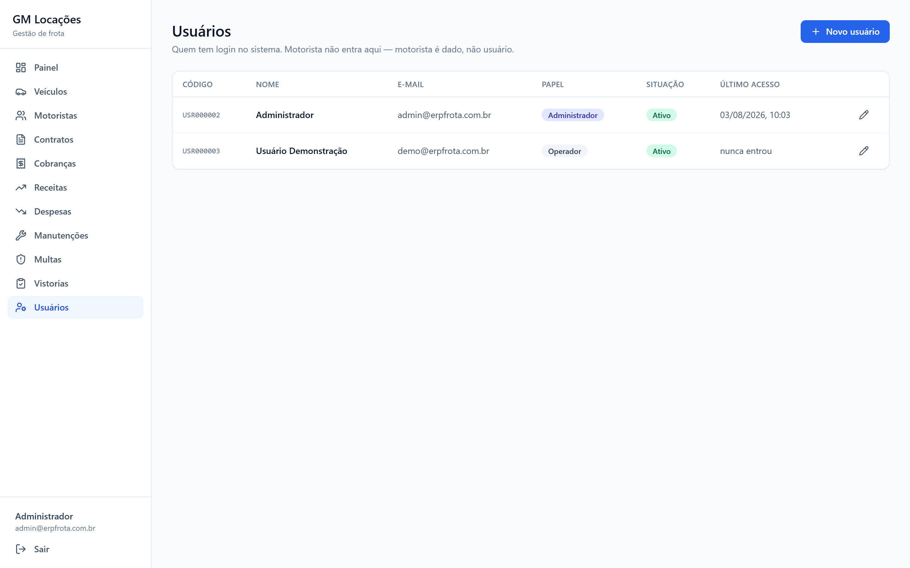

# GM Locações — ERP de Frota


**ERP completo de gestão de frota para uma locadora de veículos de motoristas de aplicativo.**

Aplicação web: API em FastAPI, interface em React e banco PostgreSQL. A própria API serve a
interface compilada — **uma porta só**, acessível do computador ou do celular na mesma rede.
Também empacota como app de desktop, para quem prefere um ícone e nenhum terminal.


> *A tela central. Todos os dados das imagens são fictícios — placas, nomes e CPFs foram
> inventados para a demonstração.*

---

## O problema

Uma locadora de carros para motoristas de app vive de uma conta que quase nunca é feita direito:
**este carro específico deu lucro?** A resposta se esconde numa planilha onde a caução virou
receita, o valor de compra foi lançado duas vezes e a multa reembolsada pelo motorista aparece
como prejuízo.

O sistema existe para responder **uma** pergunta com precisão:

```
Lucro do veículo = receitas − despesas − valor de compra + valor de venda
```

Contratos, vistorias, manutenções e multas não são módulos por serem bonitos de ter.
Cada um existe porque alimenta um termo dessa equação.

### As três armadilhas de contagem dupla

Três fatos inflariam o lucro se fossem modelados como receita ou despesa comum. Cada um mora em
**um lugar só** — e isso é regra do sistema, não preferência de estilo:

| Fato | Onde mora | Se virasse lançamento comum |
|---|---|---|
| Valor de compra | `vehicles.purchase_price` | Custo contado em dobro |
| Valor de venda | `vehicles.sale_price` | Lucro contado em dobro |
| **Caução** | `contracts.deposit_amount` | Lucro inflado até você devolver — **a caução não é sua** |

A caução só vira receita (`caucao_retida`) na parte efetivamente retida ao encerrar o contrato.

**Multas seguem a lógica inversa, de propósito:** a despesa é registrada **sempre** que você paga.
Se o motorista reembolsa, entra uma receita ligada à mesma multa e o líquido zera sozinho.
Registrar só as não-reembolsadas perderia o rastro de quanto você já desembolsou e de quanto cada
motorista te deve.

---

## Recursos

### Frota e resultado

- **Cadastro de veículos** a partir do valor de compra, com placa, RENAVAM, chassi, ano,
  combustível e odômetro. Cadastro errado se corrige — com aviso de que isso reescreve o
  resultado histórico do carro.
- **A conta do veículo:** a equação do lucro na tela, com **cada parcela clicável**, abrindo os
  lançamentos que a compõem. Nada de número que aparece sem poder ser auditado.
- **Indicadores por carro:** ROI, payback (realizado e projetado), custo por km, receita por km,
  km rodados, total a receber, despesas pendentes e investimento (capex).
- **"Se eu vender hoje":** informe o valor de mercado e o sistema mostra o resultado da venda
  imediata.
- **Venda do veículo** fecha o ciclo e trava o resultado. Vender carro com contrato ativo é
  recusado.
- **Painel** com situação da frota, resultado do mês, o que está vencido, série de receita ×
  despesa por mês e ranking de lucro.


*O painel. O gráfico é **flexbox puro, sem biblioteca de charts** — e o `Number()` que calcula a
altura das barras está comentado no código como layout, jamais como valor exibido.*


*A frota inteira com o lucro de cada carro. A frota de demonstração cobre de propósito os quatro
estados que importam: um quase no ponto de equilíbrio, um em formação, um vendido com o ciclo
fechado e um comprado na semana passada — o caso em que ROI e custo/km dividiriam por zero.*

### Locação

- **Motoristas** com CPF, RG, CNH e destaque de vencimento. Motorista **não tem login**: é dado,
  não usuário.
- **Contratos** de carro + motorista + valor semanal + caução, com anexos (PDF, assinatura).
- **Geração automática das cobranças semanais**, idempotente, a cada abertura do app.
- **Cobranças e inadimplência:** quem deve, quanto e há quantos dias, com recebimento total ou
  **parcial**.
- **Encerramento de contrato** com devolução da caução — e a parte retida virando receita.


*Inadimplência não é um campo no banco: é `status IN ('pending','partial') AND due_date < hoje`,
calculado na hora. Sem job noturno e sem estado que fica velho se o job falhar.*

### Operação

- **Receitas e despesas** amarradas a um veículo, com categorias editáveis e marcação de
  investimento (capex) separada de custo de operação.
- **Manutenções** com descrição, valor, KM e fornecedor — **gerando a despesa automaticamente**.
- **Multas** vinculadas ao carro e ao motorista, com pagamento e reembolso.
- **Vistorias** com checklist estruturado, até **200 fotos** comprimidas no navegador e foto da
  assinatura.
- **Upload de arquivos** (CNH, contratos, notas) atrás de endpoint autenticado.


*Corrigir o valor de compra é permitido — erro de digitação na migração da planilha é o caso de
uso. Mas o campo avisa o que está em jogo: aquele número é um dos quatro termos da equação.
Avisar em vez de bloquear.*

### Governança

- **Usuários e papéis:** `operador` toca o dia a dia; `admin` faz o que não tem volta (19
  endpoints exigem admin). Usuário não se exclui — se desativa.
- **Auditoria append-only** de quem mudou o quê, com o "de → para" de cada campo.
- **Backup verificável** do banco e dos arquivos, com restauração testada.
- **Modo demonstração isolado**, em banco próprio, para mostrar o sistema sem expor dado real.



*Usuário se **desativa**, não se exclui: o log de auditoria aponta para o e-mail de quem agiu, e
apagar a linha deixaria o histórico órfão de contexto. Pelo mesmo motivo o e-mail não é editável.*

### No celular

 

Layout responsivo de verdade, não "encolhido": no telefone o menu vira **gaveta** e fecha sozinha
ao navegar; as tabelas rolam dentro do próprio container, então **a página nunca rola na
horizontal**. Verificado em viewport de Pixel 7 (412 px).

---

## Tecnologias

### Backend — Python

| Tecnologia | Versão | Papel |
|---|---|---|
| **Python** | 3.13 | Linguagem do backend |
| **FastAPI** | 0.118 | API REST, injeção de dependência, OpenAPI automático em `/docs` |
| **SQLAlchemy** | 2.0 | ORM em estilo declarativo tipado (`Mapped[...]`) |
| **Alembic** | 1.16 | Migrações versionadas, desde o primeiro commit |
| **PostgreSQL** | 16 | Banco. Sequences para códigos legíveis, `UNIQUE` parcial, `CHECK` |
| **psycopg** | 3.2 | Driver, em binário para não exigir compilador |
| **Pydantic** | 2.11 | Schemas de entrada e saída · `pydantic-settings` para configuração |
| **PyJWT** · **bcrypt** | 2.10 · 5.0 | Autenticação por token e hash de senha |
| **Pillow** | 11.3 | Processamento das imagens de vistoria |
| **pytest** · **httpx** | 8.4 · 0.28 | 120 testes contra a API real, em banco descartável |

### Frontend — TypeScript

| Tecnologia | Versão | Papel |
|---|---|---|
| **React** | 19 | Interface |
| **TypeScript** | 6.0 | Tipagem estática ponta a ponta |
| **Vite** | 8.1 | Build e dev server com HMR |
| **Tailwind CSS** | 4.3 | Estilo, via plugin oficial do Vite |
| **TanStack Query** | 5.101 | Estado do servidor: cache, invalidação, refetch. **Sem Redux** |
| **React Hook Form** + **Zod** | 7.81 · 4.4 | Formulários e validação com o mesmo schema do tipo |
| **React Router** | 7.18 | Rotas, em português para não colidir com as da API |
| **Axios** | 1.18 | Cliente HTTP com interceptor de token |
| **lucide-react** · **oxlint** | — | Ícones · linter |

**Sem biblioteca de gráficos, sem biblioteca de tabelas, sem gerenciador de estado global.**
O gráfico do painel é flexbox; as tabelas são `<table>`; o estado de servidor é do TanStack Query e
o de formulário é do React Hook Form. Não sobrou estado para um Redux administrar.

### Desktop e distribuição

| Tecnologia | Papel |
|---|---|
| **Electron** 33 | Casca: sobe o Postgres embutido, o backend e a janela |
| **electron-builder** 25 | Instalador NSIS para Windows |
| **PyInstaller** | Empacota a API num `.exe` de 62 MB — quem instala não precisa de Python |
| **PostgreSQL portátil** | Vai dentro do instalador. Sem Docker, sem serviço, sem instalação |

---

## Decisões de engenharia

**Dinheiro é `Decimal` / `Numeric(12,2)` ponta a ponta.** Nenhum `float` em lugar nenhum. A API
entrega valores monetários como *string* para o JavaScript não estragar na desserialização, e o
frontend **nunca** faz conta de dinheiro — só exibe. Em ERP financeiro, `float` é bug de dinheiro
esperando data para acontecer.

**Auditoria por event listener do SQLAlchemy, não por chamada no service.** Chamar
`registrar_auditoria()` em cada service é justamente o que o humano cansado esquece — e log com
buraco é pior que log nenhum. O listener não tem como esquecer. O preço: services não podem usar
bulk DML (`session.execute(update(...))`) em tabela auditada, porque o listener é cego a isso.

**Cobrança semanal idempotente** por `UNIQUE(contract_id, period_start)`. Roda toda vez que o app
abre, sem cron, sem fila e sem duplicar. A garantia é do banco, não do código de aplicação.

**Inadimplência é derivada**, não armazenada. Sem job noturno e sem um campo que fica velho se o
job falhar.

**Divisão por zero devolve `NULL`, não 500.** `custo_por_km` divide pela quilometragem rodada e
`roi` divide pelo investimento — carro recém-comprado zera os dois denominadores. É o caso normal
no primeiro dia de uso, não uma exceção.

**Alembic desde o primeiro commit**, nunca `create_all` — inclusive nos testes, que rodam contra o
mesmo schema que vai para produção, com os `CHECK`s e índices parciais que *são* a regra de negócio.

**Códigos legíveis** (`CAR000001`, `CTR000001`) vêm de sequences do Postgres. A chave primária é
UUID; o código nunca é PK.

**Postgres embutido, não instalado.** O app carrega um Postgres 16 portátil e o sobe sozinho.

**Fotos comprimidas no navegador** (1600 px, JPEG 0.8) antes do upload: 200 fotos de celular caem
de ~1 GB para ~20 MB.

---

## Segurança e LGPD

O repositório é público. Isso é uma decisão, e ela impõe regras:

- **Nenhuma senha no código-fonte.** Senha padrão em repositório aberto é senha de todo mundo.
  O admin é criado no primeiro boot com uma senha **sorteada** (`secrets.token_urlsafe`), entregue
  num arquivo que pede para ser apagado após o primeiro acesso.
- **Segredo do JWT sorteado por instalação.** Sem isso, todas as instalações compartilhariam o
  segredo do código-fonte e qualquer um forjaria um token de admin. Fora de `ENV=dev`, subir com o
  segredo padrão é erro fatal por decisão.
- **`storage/` nunca é servido como pasta estática.** CNH, CPF e contratos são dado pessoal:
  download só pelo endpoint autenticado `GET /files/{key}`.
- **Nada de dado real em teste** nem em demonstração. Nenhum motorista, placa ou CPF verdadeiro.
- **`hashed_password` nunca sai** em schema de saída, e senha/token/CPF nunca vão para log.
- O banco escuta apenas em `localhost` — é um banco de uma máquina só.

---

## Arquitetura

```
backend/             FastAPI · SQLAlchemy 2 · Alembic · Python 3.13
  app/core/            config · errors · security · context · storage · paths
  app/db/              session · base (importa todos os models)
  app/domains/<dom>/   models · schemas · service · router   (um pacote por domínio)
  run_server.py        entrada do .exe   ·   erp-frota-api.spec   receita do PyInstaller
frontend/            React 19 · TypeScript · Vite · Tailwind · TanStack Query · RHF + Zod
desktop/             Electron: sobe o Postgres embutido, o backend e a janela
scripts/             backup.ps1 · demo.ps1 · seed_demo.py
```

**Um pacote por domínio**, cada um com `models · schemas · service · router`. Onze domínios:
veículos, motoristas, contratos, receitas, despesas, manutenções, multas, vistorias, arquivos,
usuários e auditoria — mais `finance`, que só lê e calcula.

**A API serve a interface compilada.** Funciona porque as rotas da interface são em português
(`/veiculos`) e as da API em inglês (`/vehicles`): não colidem. Uma porta só, sem CORS e sem
servidor web separado.

**Portas:** 5434 (banco), 8010 (API), 5273 (Vite). Não são as padrão de propósito — as usuais já
estavam ocupadas na máquina de desenvolvimento. O Vite roda com `strictPort`: se a porta estiver
ocupada ele falha, em vez de subir em outra e servir o app errado em silêncio.

---

## Rodar o projeto

**Pré-requisitos:** Python **3.13** (não 3.14), Node 20+, e o Postgres portátil em
`desktop/vendor/pgsql` ([binários](https://get.enterprisedb.com/postgresql/postgresql-16.10-1-windows-x64-binaries.zip), ~300 MB, fora do git).

```bash
# 1. Banco  (só a 1ª linha e a 3ª são "uma vez só")
PG="desktop/vendor/pgsql/bin";  DATA="$LOCALAPPDATA/GM Locacoes/pgdata"
"$PG/initdb" -D "$DATA" -U frota -A trust -E UTF8 --locale=C
"$PG/pg_ctl" -D "$DATA" -o "-p 5434" -w start
"$PG/createdb" -h 127.0.0.1 -p 5434 -U frota frota

# 2. API  →  http://127.0.0.1:8010   (docs interativas em /docs)
cd backend && py -3.13 -m venv .venv && .venv/Scripts/activate
pip install -r requirements-dev.txt && cp ../.env.example .env
alembic upgrade head && uvicorn app.main:app --reload --port 8010

# 3. Interface  →  http://localhost:5273
cd frontend && npm install && npm run dev
```

O admin é criado no 1º boot com senha sorteada, gravada em
`%LOCALAPPDATA%\GM Locacoes\senha-inicial-admin.txt`.

> **Python 3.13, não 3.14.** No 3.14 o `pip install` falha: `pydantic-core` não tem wheel `cp314`,
> cai em compilação Rust e o PyO3 recusa Python acima do 3.13.
>
> **`pg_ctl start` trava se a saída for canalizada no PowerShell.** O servidor herda o handle de
> stdout e o pipeline nunca fecha. Não use `|`.

```bash
cd backend && pytest              # 120 testes, em banco `frota_test` descartável
.\scripts\web.ps1                 # acesso pela rede local (celular, tablet, outro PC)
.\scripts\demo.ps1                # demonstração isolada em http://127.0.0.1:8011
.\scripts\backup.ps1 -Verificar   # backup + prova de que ele restaura
```

### Acessar do celular

```powershell
.\scripts\web.ps1     # → http://192.168.x.x:8010  (mesmo Wi-Fi)
```

Compila a interface, sobe a API em `0.0.0.0` e mostra o endereço para abrir no telefone. Uma
porta só: sem Vite, sem CORS, sem segundo servidor.

> **É HTTP, não HTTPS.** Senha e token trafegam em texto claro no Wi-Fi. Rede de casa, para
> testar: aceitável. Rede pública: não. Para uso real fora da sua rede, isto precisa de HTTPS
> (proxy reverso com certificado) ou de um túnel privado — Tailscale ou WireGuard.
>
> **O banco não acompanha.** O Postgres continua preso em `localhost`, com `-A trust`, porque só
> o backend desta máquina fala com ele. Expor a porta 5434 na rede seria entregar o banco inteiro
> sem pedir senha.

**A demonstração roda em banco próprio** porque os papéis limitam *ações*, não *visibilidade*: é um
ERP de uma empresa só, e entrar como "usuário demo" no banco real mostraria CPF e CNH de gente de
verdade. A única separação possível é outro banco.

**O backup copia banco e arquivos juntos** — obrigatório, não zelo: o banco guarda o *caminho* do
arquivo, nunca os bytes. Restaurar só o banco devolveria um sistema apontando para PDFs e fotos que
não existem mais. O `-Verificar` restaura num banco descartável e confere: backup que nunca foi
restaurado não é backup, é esperança.

---

## Também roda como app de desktop

O sistema é web, mas empacota como aplicativo instalável — útil para quem vai usar só na própria
máquina e não quer saber de endereço nem de terminal. O Electron sobe o Postgres portátil, a API e
a janela; a interface é a mesma.

```bash
# ANTES: ligue o Modo de desenvolvedor do Windows (o electron-builder cria symlinks)
cd frontend && npm run build
cd ../backend && pyinstaller erp-frota-api.spec --noconfirm
cd ../desktop && npm install && npm run dist     # → desktop/dist/GM Locações Setup 1.0.0.exe
```

Instale e pronto: ícone na área de trabalho, **sem Python, sem Docker e sem terminal**. O Postgres
portátil viaja dentro do instalador e é inicializado na primeira execução. O `.exe` não é assinado
(~US$ 200/ano), então o Windows mostra o aviso "protegeu o seu PC" uma vez por máquina.

**Onde ficam os dados** — tudo em `%LOCALAPPDATA%\GM Locacoes\`, porque `C:\Program Files` não é
gravável e o primeiro upload de foto daria "Acesso negado":

| Caminho | O que é |
|---|---|
| `pgdata\` | O banco (cluster do Postgres embutido) |
| `storage\` | Fotos, contratos e notas fiscais |
| `backups\` | Cópias de segurança (as 10 mais recentes) |
| `secret.key` | Segredo do JWT, sorteado nesta instalação |
| `senha-inicial-admin.txt` | Senha do primeiro acesso — apague depois de usar |
| `logs\backend.log` | A única pista quando o app não abre |

---

## Roadmap

Relatórios PDF/Excel · alertas automáticos · busca global · plano de manutenção preventiva ·
agendamento automático do backup · app Android · rastreador · integração com WhatsApp ·
assinatura eletrônica.

Cada um tem gancho no schema. Nenhum exige reescrita.

## Licença

Proprietário — todos os direitos reservados. O repositório é público **para leitura e avaliação**:
é peça de portfólio, não software de uso livre. Detalhes em [LICENSE](LICENSE).

---

Notas de arquitetura e regras permanentes em [CLAUDE.md](CLAUDE.md) · diário de decisões em
[BACKLOG.md](BACKLOG.md) · a visão original em [MANIFESTO.md](MANIFESTO.md).
