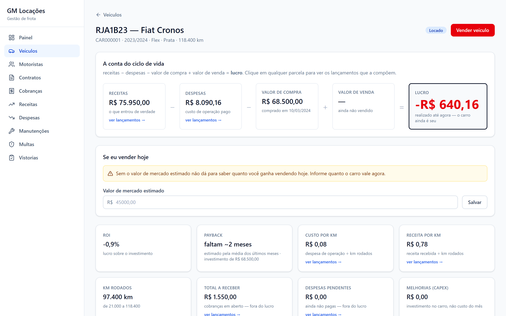
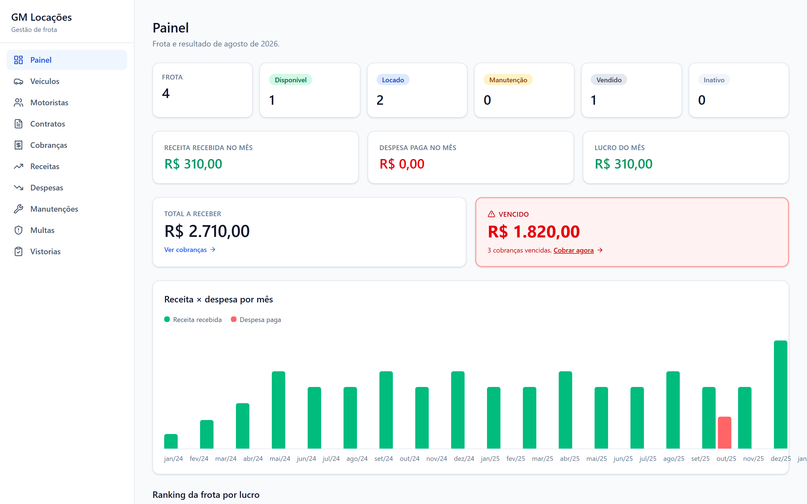
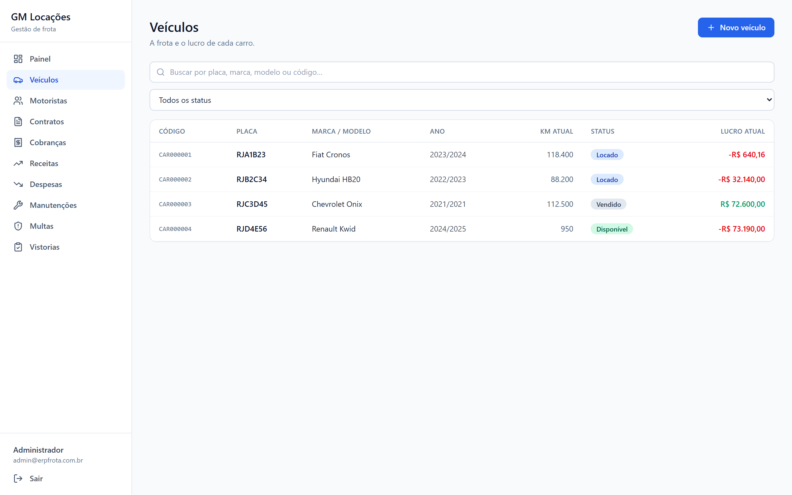
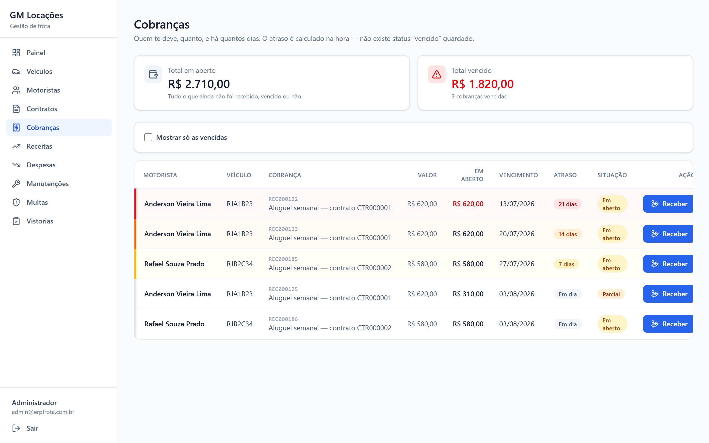
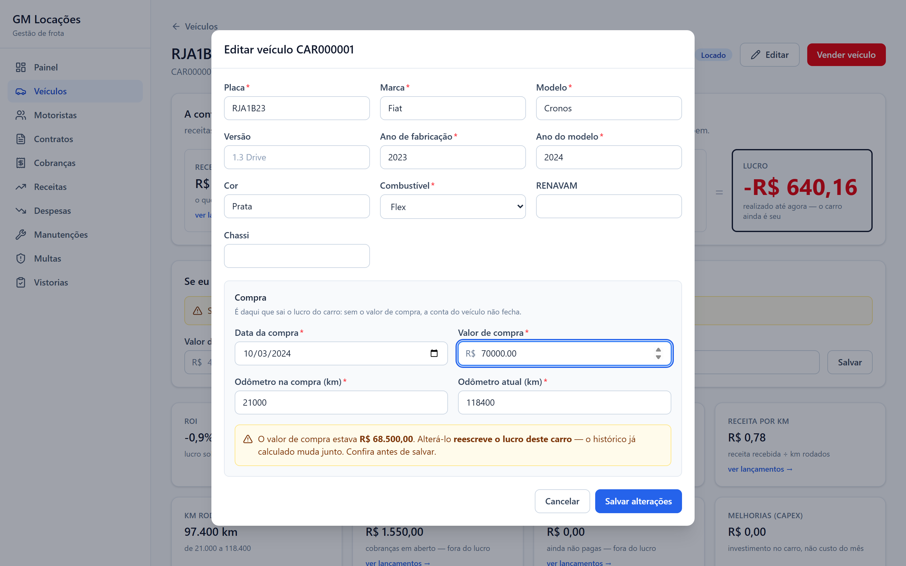
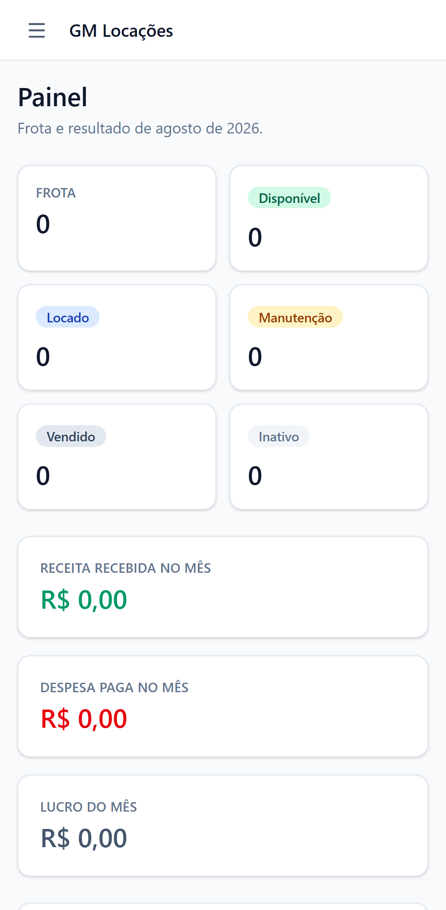
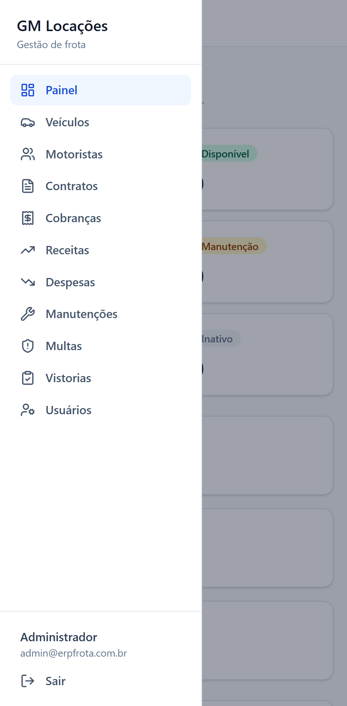

<div align="center">

# GM Locações

### ERP de gestão de frota para locadora de veículos

*Um sistema construído em torno de uma única pergunta: **este carro deu lucro?***


</div>

---

Aplicação web completa — API em Python, interface em TypeScript, banco PostgreSQL. A própria
API serve a interface compilada: **uma porta só**, acessível do computador ou do celular na
mesma rede. Também empacota como aplicativo de desktop, para quem prefere um ícone e nenhum
terminal.



<sub>A tela central. **Todos os dados das imagens são fictícios** — placas, nomes e documentos
foram inventados para a demonstração.</sub>

<br>

## O problema

Uma locadora de carros para motoristas de aplicativo vive de uma conta que quase nunca é feita
direito: **este carro específico deu lucro?**

A resposta se esconde numa planilha onde a caução virou receita, o valor de compra foi lançado
duas vezes e a multa reembolsada pelo motorista aparece como prejuízo.

O sistema existe para responder **uma** pergunta com precisão:

```
Lucro do veículo  =  receitas − despesas − valor de compra + valor de venda
```

Contratos, vistorias, manutenções e multas não são módulos por serem bonitos de ter. Cada um
existe porque alimenta um termo dessa equação.

### As três armadilhas de contagem dupla

Três fatos inflariam o lucro se fossem modelados como receita ou despesa comum. Cada um mora em
**um lugar só** — regra do sistema, não preferência de estilo.

| Fato | Onde mora | Se virasse lançamento comum |
|:--|:--|:--|
| Valor de compra | campo do veículo | custo contado em dobro |
| Valor de venda | campo do veículo | lucro contado em dobro |
| **Caução** | campo do contrato | lucro inflado até você devolver — **a caução não é sua** |

A caução só vira receita na parte efetivamente retida, no encerramento do contrato.

**Multas seguem a lógica inversa, de propósito.** A despesa é registrada **sempre** que você
paga. Se o motorista reembolsa, entra uma receita ligada à mesma multa e o líquido zera
sozinho. Registrar apenas as não reembolsadas perderia o rastro de quanto você desembolsou e de
quanto cada motorista te deve.

<br>

## Recursos

<table>
<tr><td width="50%" valign="top">

**Frota e resultado**

- Cadastro de veículos com placa, documento, ano, combustível e odômetro
- A equação do lucro na tela, com **cada parcela clicável**, abrindo os lançamentos que a compõem
- Indicadores por carro: retorno sobre investimento, payback realizado e projetado, custo por km, receita por km
- *"Se eu vender hoje"* — resultado da venda imediata a preço de mercado
- Venda fecha o ciclo e trava o resultado
- Painel com situação da frota, resultado do mês, vencidos e ranking de lucro

</td><td width="50%" valign="top">

**Locação**

- Motoristas com documentos e alerta de vencimento de habilitação
- Contratos de carro + motorista + valor semanal + caução, com anexos
- **Geração automática das cobranças semanais**, idempotente
- Inadimplência: quem deve, quanto e há quantos dias
- Recebimento total ou **parcial**
- Encerramento com devolução da caução — e a parte retida virando receita

</td></tr>
<tr><td width="50%" valign="top">

**Operação**

- Receitas e despesas amarradas a um veículo, com investimento separado de custo de operação
- Manutenções **gerando a despesa automaticamente**
- Multas vinculadas ao carro e ao motorista, com pagamento e reembolso
- Vistorias com checklist, até **200 fotos** comprimidas no navegador e foto da assinatura
- Anexos atrás de endpoint autenticado

</td><td width="50%" valign="top">

**Governança**

- Dois papéis: operação no dia a dia, administração para o que não tem volta
- **Auditoria append-only** de quem mudou o quê, com o *de → para* de cada campo
- **Backup verificável** de banco e arquivos, com restauração testada
- **Modo demonstração isolado**, em banco próprio, para mostrar o sistema sem expor dado real

</td></tr>
</table>

<br>

|  |  |
|:--|:--|
|  |  |
| <sub>**O painel.** O gráfico é *flexbox puro, sem biblioteca de charts* — e o cálculo da altura das barras está marcado no código como layout, jamais como valor exibido.</sub> | <sub>**A frota inteira**, com o lucro de cada carro. A demonstração cobre de propósito os quatro estados que importam — incluindo o carro comprado na semana passada, em que os indicadores dividiriam por zero.</sub> |
|  |  |
| <sub>**Inadimplência não é um campo no banco:** é uma consulta calculada na hora. Sem tarefa noturna e sem estado que fica velho se a tarefa falhar.</sub> | <sub>**Corrigir o valor de compra é permitido** — erro de digitação na migração da planilha é o caso de uso. Mas o campo avisa o que está em jogo: aquele número é um dos quatro termos da equação.</sub> |

### No celular

<div align="center">


</div>

Layout responsivo de verdade, não "encolhido": no telefone o menu vira **gaveta** e fecha
sozinha ao navegar; as tabelas rolam dentro do próprio container, então **a página nunca rola
na horizontal**. Verificado em viewport de 412 px.

<br>

## Tecnologias

<table>
<tr>
<th align="left" width="20%">Camada</th>
<th align="left" width="20%">Base</th>
<th align="left">Como é usada</th>
</tr>
<tr>
<td><b>Backend</b></td>
<td><b>Python 3.13</b></td>
<td>API REST assíncrona com documentação interativa gerada do próprio código · ORM tipado ·
migrações versionadas desde o primeiro commit · validação de entrada e saída por schema ·
autenticação por token com senha em hash</td>
</tr>
<tr>
<td><b>Frontend</b></td>
<td><b>TypeScript 6</b> · <b>React 19</b></td>
<td>Tipagem estática ponta a ponta · cache e invalidação de estado de servidor · formulários
validados pelo mesmo schema que define o tipo · estilo utilitário compilado</td>
</tr>
<tr>
<td><b>Dados</b></td>
<td><b>PostgreSQL 16</b></td>
<td>Restrições de unicidade parciais, verificações e sequences fazem parte da regra de negócio,
não são enfeite de schema</td>
</tr>
<tr>
<td><b>Distribuição</b></td>
<td><b>Web</b> · <b>Desktop</b></td>
<td>A API serve a interface compilada numa porta só · instalador para Windows com o banco
embutido, sem dependência externa para quem usa</td>
</tr>
<tr>
<td><b>Testes</b></td>
<td><b>209 testes</b></td>
<td>Contra a API real, em banco descartável criado pelas mesmas migrações que vão para produção</td>
</tr>
</table>

**Sem biblioteca de gráficos, sem biblioteca de tabelas, sem gerenciador de estado global.** O
gráfico do painel é flexbox, as tabelas são tabelas, e o estado de servidor e o de formulário
já têm dono. Não sobrou estado para um Redux administrar.

<br>

## Decisões de engenharia

> **Dinheiro é decimal de precisão fixa, ponta a ponta.** Nenhum ponto flutuante em lugar
> nenhum. A API entrega valores monetários como texto, para o JavaScript não estragá-los na
> desserialização, e a interface **nunca** faz conta de dinheiro — só exibe. Em ERP financeiro,
> ponto flutuante é bug de dinheiro esperando data para acontecer.

> **Auditoria por escuta de eventos do ORM, não por chamada em cada operação.** Lembrar de
> registrar a auditoria em todo service é justamente o que o humano cansado esquece — e log com
> buraco é pior que log nenhum. O preço é uma regra: operações em massa ficam proibidas nas
> tabelas auditadas, porque a escuta é cega a elas.

> **Cobrança semanal idempotente**, garantida por restrição de unicidade no banco. Roda toda vez
> que o app abre, sem agendador, sem fila e sem duplicar. A garantia é do banco, não do código.

> **Inadimplência é derivada**, nunca armazenada. Sem tarefa noturna e sem um campo que fica
> velho se a tarefa falhar.

> **Divisão por zero devolve vazio, não erro 500.** Custo por km divide pela quilometragem
> rodada e o retorno divide pelo investimento — carro recém-comprado zera os dois denominadores.
> É o caso normal no primeiro dia de uso, não uma exceção.

> **Datas seguem o fuso da operação, não o do servidor.** A inadimplência é calculada a partir
> de "hoje"; um servidor em outro fuso responderia datas diferentes por três horas todo dia, e a
> mesma cobrança apareceria em atraso para um e em dia para outro.

> **Migrações desde o primeiro commit**, inclusive nos testes — que rodam contra o mesmo schema
> que vai para produção, com as restrições que *são* a regra de negócio.

> **Códigos legíveis** (`CAR000001`, `CTR000001`) vêm de sequences do banco. A chave primária é
> UUID; o código nunca é chave.

> **Fotos comprimidas no navegador** antes do upload: 200 fotos de celular caem de ~1 GB para
> ~20 MB.

<br>

## Segurança e proteção de dados pessoais

O repositório é público. Isso é uma decisão, e ela impõe regras:

- **Nenhuma senha no código-fonte.** Senha padrão em repositório aberto é senha de todo mundo. O
  administrador é criado no primeiro boot com uma senha **sorteada**, entregue num arquivo que
  pede para ser apagado após o primeiro acesso.
- **Segredo de assinatura sorteado por instalação.** Sem isso, todas as instalações
  compartilhariam o segredo do código-fonte e qualquer um forjaria um token de administrador.
  Fora de desenvolvimento, subir com o segredo padrão é erro fatal por decisão.
- **Arquivos nunca são servidos como pasta estática.** Documentos pessoais e contratos só saem
  pelo endpoint autenticado — e apenas enquanto o cadastro dono deles existir.
- **Nada de dado real** em teste ou demonstração. Nenhum motorista, placa ou documento verdadeiro.
- **Hash de senha nunca sai** em resposta da API, e senha, token e documento nunca vão para log.

<br>

## Arquitetura

```
backend/               API · ORM · migrações                        Python
  app/core/              configuração · erros · segurança · armazenamento
  app/db/                sessão · base
  app/domains/<dom>/     models · schemas · service · router    um pacote por domínio
frontend/              interface · rotas · formulários             TypeScript
desktop/               casca: sobe o banco embutido, a API e a janela
scripts/               backup · demonstração · acesso pela rede
```

**Um pacote por domínio**, cada um com a mesma estrutura de quatro arquivos. Treze domínios:
veículos, motoristas, contratos, receitas, despesas, manutenções, multas, vistorias, arquivos,
usuários, auditoria e autenticação — mais um que só lê e calcula.

**A API serve a interface compilada.** Funciona porque as rotas da interface são em português
(`/veiculos`) e as da API em inglês (`/vehicles`): não colidem. Uma porta só, sem CORS e sem
servidor web separado.

<br>

## Rodar o projeto

**Pré-requisitos:** Python 3.13, Node 20+, e o PostgreSQL portátil em `desktop/vendor/pgsql`
(~300 MB, fora do controle de versão).

```bash
# 1. Banco
PG="desktop/vendor/pgsql/bin";  DATA="$LOCALAPPDATA/GM Locacoes/pgdata"
"$PG/initdb" -D "$DATA" -U frota -A trust -E UTF8 --locale=C
"$PG/pg_ctl" -D "$DATA" -o "-p 5434" -w start
"$PG/createdb" -h 127.0.0.1 -p 5434 -U frota frota

# 2. API  →  http://127.0.0.1:8010   (documentação interativa em /docs)
cd backend && py -3.13 -m venv .venv && .venv/Scripts/activate
pip install -r requirements-dev.txt && cp ../.env.example .env
alembic upgrade head && uvicorn app.main:app --reload --port 8010

# 3. Interface  →  http://localhost:5273
cd frontend && npm install && npm run dev
```

O administrador é criado no primeiro boot com senha sorteada, gravada em
`%LOCALAPPDATA%\GM Locacoes\senha-inicial-admin.txt`.

```bash
cd backend && pytest              # 209 testes, em banco descartável
.\scripts\web.ps1                 # acesso pela rede local (celular, tablet, outro PC)
.\scripts\demo.ps1                # demonstração isolada
.\scripts\backup.ps1 -Verificar   # backup + prova de que ele restaura
```

> **A demonstração roda em banco próprio** porque papéis limitam *ações*, não *visibilidade*: é
> um ERP de uma empresa só, e entrar como usuário de demonstração no banco real mostraria dado
> pessoal de gente de verdade. A única separação possível é outro banco.

> **O backup copia banco e arquivos juntos** — obrigatório, não zelo: o banco guarda o *caminho*
> do arquivo, nunca os bytes. Restaurar só o banco devolveria um sistema apontando para
> documentos que não existem mais. A verificação restaura numa cópia descartável e confere:
> backup que nunca foi restaurado não é backup, é esperança.

### Acesso pela rede local

```powershell
.\scripts\web.ps1     # → http://192.168.x.x:8010  (mesmo Wi-Fi)
```

Compila a interface, sobe a API e mostra o endereço para abrir no telefone.

> **É HTTP, não HTTPS.** Senha e token trafegam em texto claro no Wi-Fi. Rede de casa, para
> testar: aceitável. Rede pública: não. Para uso real fora da sua rede, isto precisa de HTTPS ou
> de um túnel privado.
>
> **O banco não acompanha.** Ele continua preso ao computador local — expor a porta na rede
> seria entregar o banco inteiro sem pedir senha.

<br>

## Também roda como aplicativo de desktop

O sistema é web, mas empacota como aplicativo instalável — útil para quem vai usar só na própria
máquina e não quer saber de endereço nem de terminal. A casca sobe o banco portátil, a API e a
janela; a interface é a mesma.

```bash
cd frontend && npm run build
cd ../backend && pyinstaller erp-frota-api.spec --noconfirm
cd ../desktop && npm install && npm run dist
```

Instale e pronto: ícone na área de trabalho, **sem dependência nenhuma para quem usa**. O banco
portátil viaja dentro do instalador e é inicializado na primeira execução.

**Onde ficam os dados** — tudo em `%LOCALAPPDATA%\GM Locacoes\`, porque `C:\Program Files` não é
gravável e o primeiro upload de foto daria "Acesso negado":

| Caminho | O que é |
|:--|:--|
| `pgdata\` | O banco |
| `storage\` | Fotos, contratos e notas |
| `backups\` | Cópias de segurança (as 10 mais recentes) |
| `secret.key` | Segredo de assinatura, sorteado nesta instalação |
| `senha-inicial-admin.txt` | Senha do primeiro acesso — apague depois de usar |
| `logs\backend.log` | A única pista quando o app não abre |

<br>

## Roadmap

Relatórios em PDF e planilha · alertas automáticos · busca global · plano de manutenção
preventiva · agendamento do backup · aplicativo Android · rastreador · integração com
mensageria · assinatura eletrônica.

Cada um tem gancho no schema. Nenhum exige reescrita.

<br>

## Licença

Proprietário — todos os direitos reservados. O repositório é público **para leitura e
avaliação**: é peça de portfólio, não software de uso livre. Detalhes em [LICENSE](LICENSE).

<sub>Diário de decisões em [BACKLOG.md](BACKLOG.md) · a visão original em
[MANIFESTO.md](MANIFESTO.md).</sub>
